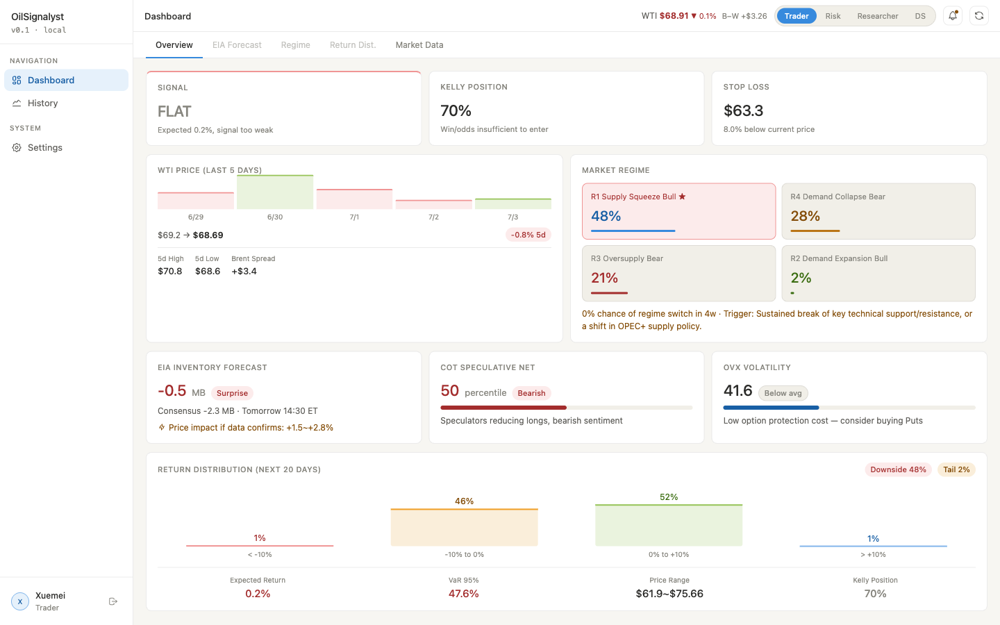
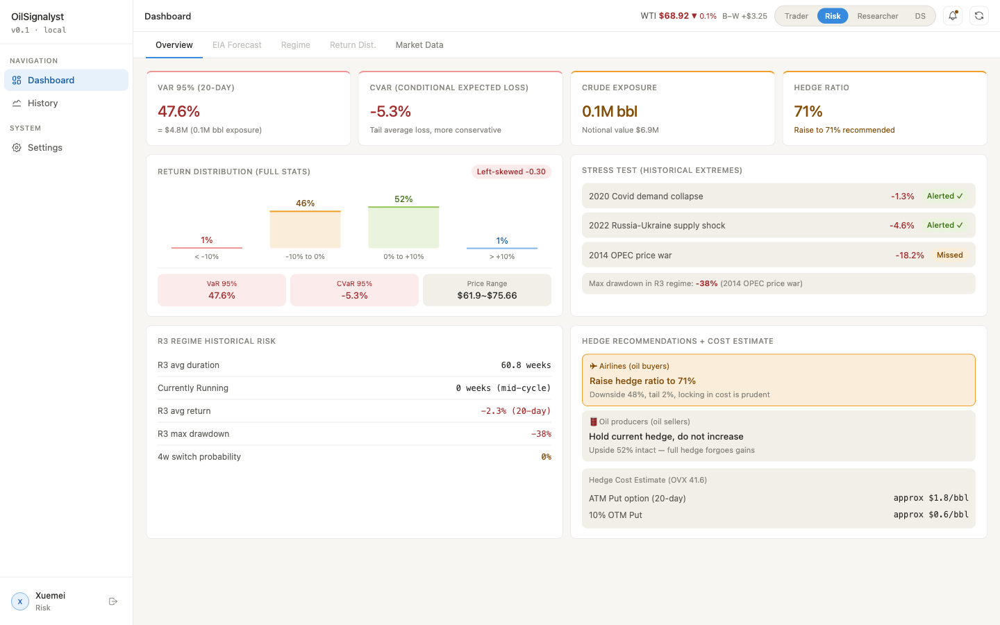
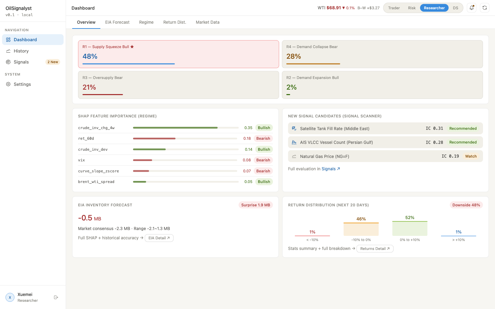
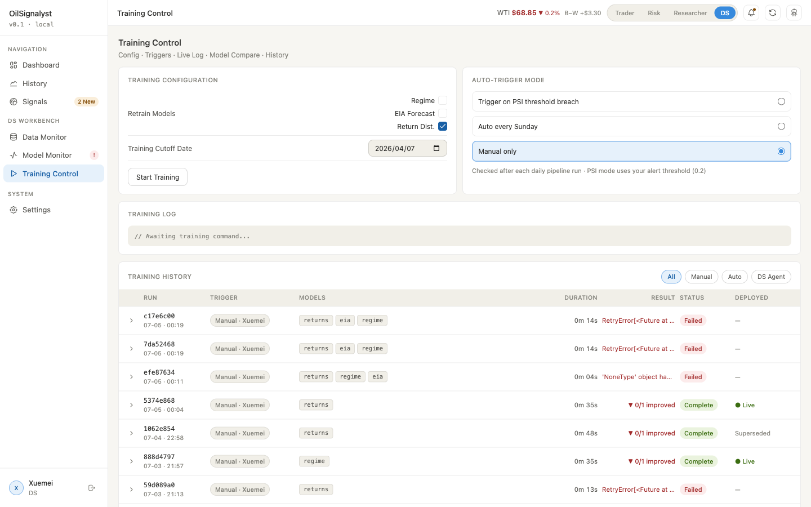
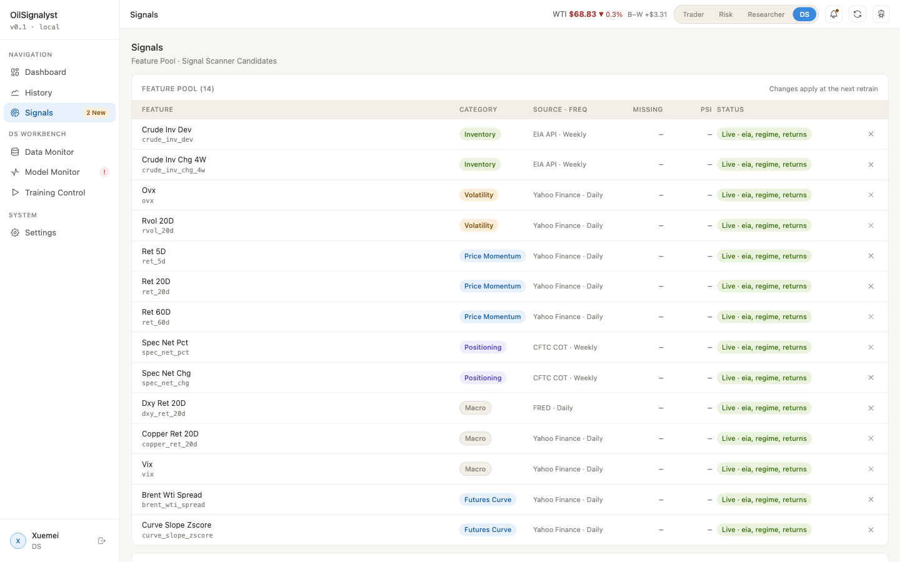

# oil-signalyst

An end-to-end oil-market signal research platform: live market data →
a three-model ML stack → a **role-gated decision cockpit**. One codebase
serves a trader, a risk manager, a researcher, and a data scientist — each
gets a purpose-built view of the *same* daily inference run.

- **Backend** — FastAPI service (JWT auth, role-aware reporting/signal API,
  WebSocket price ticker, OpenAI-backed DS Agent) + a separate scheduler
  process running the daily ingest → inference pipeline.
- **Frontend** — React 18 + Vite + TypeScript SPA that consumes the API
  directly (no mock layer).
- **ML** — regime classification, EIA inventory forecasting, and conditional
  return-distribution models, all served via a hosted TabPFN API, with PSI
  drift monitoring and SHAP explainability.

Architecture deep-dives: [system](docs/architecture.md) ·
[backend](docs/architecture-backend.md) ·
[frontend](docs/architecture-frontend.md).

## One platform, four roles

The dashboard is gated by the logged-in user's role. The same underlying
prediction is reframed for each consumer — the trader sees entries and
position sizing, risk sees tail exposure and hedges, the researcher sees the
model internals. The navigation itself changes: the DS Workbench only exists
for data scientists.

### Trader — signal, sizing, entry

Kelly-sized position, stop-loss, regime probabilities, and the EIA/COT/vol
context behind the call.



### Risk — exposure, tails, hedges

VaR / CVaR at the desk's notional, historical stress replays, and concrete
hedge recommendations with option-cost estimates.



### Researcher — model internals

Regime probabilities, SHAP feature importances, and the signal scanner's new
candidate features ranked by information coefficient.



## DS Workbench (data-scientist only)

Behind the same login, a data scientist gets the operator surface: data-source
freshness, model drift, the feature pool, and full training control.

### Training control + run history

Retrain any subset of the three models, choose the auto-retrain trigger
(PSI breach / weekly / manual), stream the live log, and compare-and-deploy
against a full history of past runs — each tagged with its trigger source,
result, and live/superseded deploy state.



### Signal research — the feature pool

The live feature pool with per-feature source, cadence, drift, and which
models consume it. The signal scanner proposes new candidates that a
researcher can evaluate and adopt into the pool for the next retrain.



## Local development

Backend:

```bash
cd backend
uv sync --extra dev
uv run alembic upgrade head
uv run uvicorn api.main:app --reload --port 8000
```

Integration tests need network access and valid `EIA_API_KEY` /
`FRED_API_KEY` in `.env`. A single local user is seeded on first run
(password from `DEFAULT_USER_PASSWORD`).

Daily pipeline scheduler (separate process — the API does **not** run it).
Without it the feature matrix and predictions never advance and the Data
Monitor shows stale data. Under Docker Compose this is the `scheduler`
service.

```bash
cd backend
uv run python -m scheduler.runner
```

It runs `run_daily_pipeline` on a cron (`PIPELINE_CRON_HOUR`/`_MINUTE`,
default 22:00 UTC) plus a weekly signal scan. To run one pass immediately:
`uv run python -c "import asyncio; from scheduler.jobs import
run_daily_pipeline; asyncio.run(run_daily_pipeline())"`.

Frontend (separate terminal, backend must be on `:8000`):

```bash
cd frontend
npm install
npm run dev
```

## Docker Compose

```bash
docker compose up -d --build
```

Starts `frontend` (nginx, reverse-proxying `/api` and `/ws` to `api` so the
whole stack is same-origin — no CORS config needed), `api`, `scheduler`, and
a one-shot `migrate` job. Reachable at `http://localhost:5173`. Requires a
populated `.env` at the repo root (see `.env.example`).
