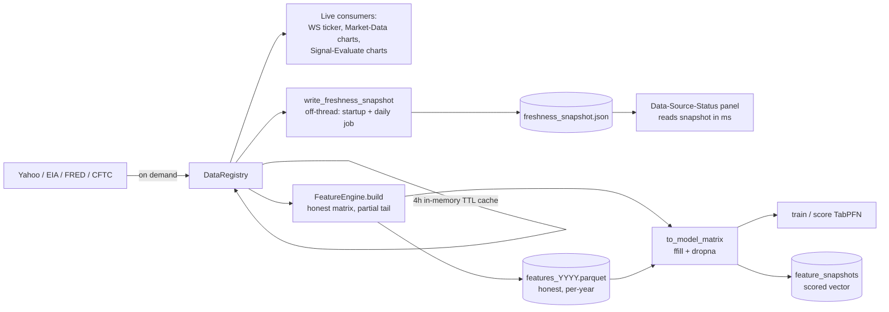
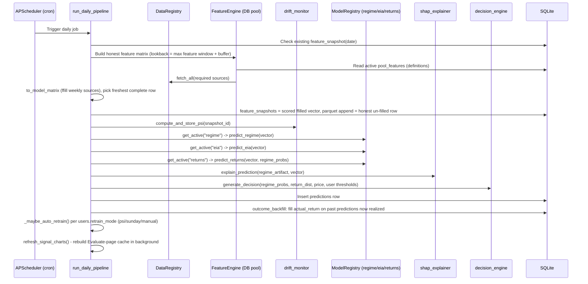
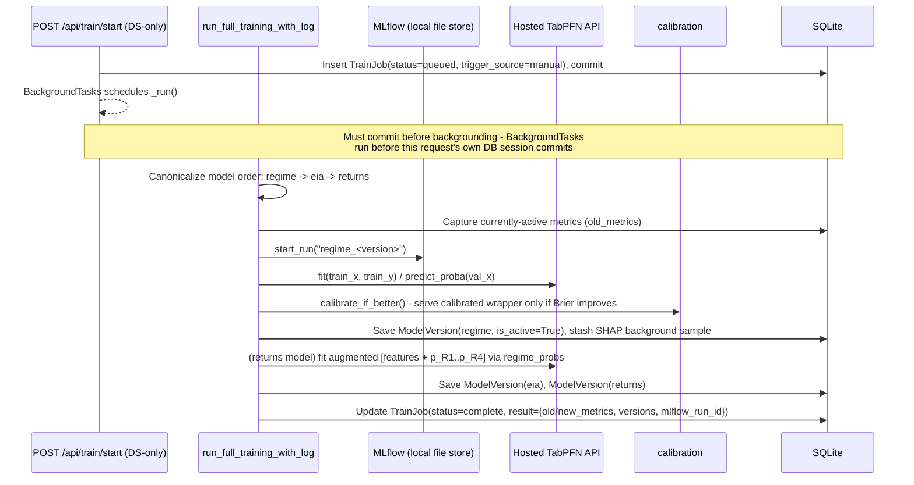

# Backend Architecture

Single-service FastAPI backend for oil-market signal research: ingests raw market/positioning/inventory data, engineers features, trains a three-model ML stack (regime classification, EIA inventory forecasting, conditional return distribution) via a hosted TabPFN API, runs a daily inference pipeline with drift monitoring and explainability, and serves JWT-secured role-specific reports, a signal-research + feature-pool surface, and a real-OpenAI DS Agent over HTTP.

This file is the backend deep-dive. See `docs/architecture.md` for the system-level overview (runtime containers, high-level data flow) shared with the rest of the project.

## Module Map

```
backend/
├── api/
│   ├── main.py              # FastAPI app factory, CORS, lifespan: init_db, default user,
│   │                        # awaited fail_orphaned_jobs() (buries train jobs a restart
│   │                        # left mid-run), then two fire-and-forget prewarms -
│   │                        # signal charts + freshness snapshot
│   ├── dependencies.py      # DbSession, CurrentUser (JWT Bearer), role guards
│   │                        # (ResearcherOrDS, DSOnly)
│   └── routes/
│       ├── health.py        # GET /health
│       ├── auth.py          # POST /api/auth/login|refresh|logout (JWT + httpOnly cookie)
│       ├── reports.py       # GET /api/reports/daily/{role}, /history, /history/{date}, /stress
│       ├── models.py        # GET /api/models/status, POST /api/models/{type}/deploy (DS-only)
│       ├── training.py      # POST /api/train/start (DS-only; 409s if a job is already
│       │                    # in flight - concurrent runs would race the single
│       │                    # is_active row per model type), GET /status|/log (SSE)|
│       │                    # /jobs (history); fail_orphaned_jobs() called at startup
│       ├── signals.py       # GET /api/signals|/candidates|/active|/evaluate/{name};
│       │                    # POST /{name}/pool|/ignore|/restore, DELETE /{name}/pool
│       ├── users.py         # GET/PUT /api/users/me[/config]
│       ├── market.py        # GET /api/market/{series_id} (raw source series for charts)
│       ├── ws.py            # WebSocket /ws/price (live WTI ticker, 30s poll)
│       └── agent.py         # POST /api/agent/message|/confirm/{id}|/cancel/{id}, GET /stream (SSE)
│
├── auth/                    # JWT encode/decode (jwt.py), password hashing (password.py);
│                            # top-level, not under api/ - imported by api/dependencies.py
│
├── core/
│   ├── config.py            # Settings (env vars incl. TABPFN_API_KEY, OPENAI_API_KEY, JWT_SECRET)
│   ├── config_paths.py      # Resolved paths: data/, config/, models/, mlruns/, features/,
│   │                        # FRESHNESS_SNAPSHOT (data/freshness_snapshot.json)
│   ├── cache.py             # In-memory TTL cache (DataRegistry + signal-chart caches)
│   ├── exceptions.py        # ModelNotFoundError
│   ├── logging.py           # JSON structured logging
│   │
│   ├── data/
│   │   ├── registry.py      # DataRegistry: fetch/fetch_all, alignment, clear_cache()
│   │   └── sources/         # yahoo.py, eia.py, fred.py, cftc.py adapters
│   │
│   ├── market/               # Market Data chart series (GET /api/market/{series_id})
│   │   ├── fetcher.py        # Six chart fetchers (wti price, brent spread, EIA inventory,
│   │   │                     # futures curve, OVX/VIX, COT net) over one module-level
│   │   │                     # _REGISTRY so the 4h TTL cache persists across requests;
│   │   │                     # futures_curve bypasses DataRegistry (own 30m cache,
│   │   │                     # batched yfinance download)
│   │   └── series.py         # SERIES dict: series_id -> fetcher, the route's whitelist
│   │
│   ├── models/               # Training + inference for the 3 production models
│   │   ├── trainer.py        # run_full_training[_with_log](model_types, cutoff_date);
│   │   │                     # canonicalizes model order regime->eia->returns, and
│   │   │                     # load_features() sorts columns so every call returns the
│   │   │                     # same order no matter which yearly Parquet files backed it.
│   │   │                     # All blocking work (_prepare_training_data, TabPFN fits,
│   │   │                     # joblib.dump) runs via asyncio.to_thread - training no
│   │   │                     # longer stalls the event loop, hence the 409 guard above
│   │   ├── feature_prep.py    # to_model_matrix(): ffill weekly sources forward, drop warmup
│   │   │                     # gaps - the one path that completes rows before any model
│   │   ├── regime.py          # TabPFNClassifier wrapper, dominant_regime(), predict_regime[_batch]()
│   │   ├── eia.py             # TabPFNRegressor wrapper, predict_eia()
│   │   ├── returns.py         # TabPFNClassifier wrapper, regime-probability feature augmentation
│   │   ├── calibration.py     # sklearn FrozenEstimator + CalibratedClassifierCV, reliability plots
│   │   ├── regime_validation.py # GMM cross-check against hand-curated regime labels
│   │   ├── regime_labels.py   # REGIME_TRANSITIONS (hand-curated ground truth) -> daily series
│   │   ├── labels.py          # Regime/EIA/return-bucket label builders from raw data
│   │   ├── model_registry.py  # In-memory cache of active model artifacts (ModelRegistry)
│   │   ├── tabpfn_setup.py    # ensure_tabpfn_authenticated() - lazy hosted-API auth
│   │   └── common.py          # classifier_metrics(), as_named_row() (TabPFN column-name shim)
│   │
│   ├── postprocess/           # Everything downstream of a raw model prediction
│   │   ├── decision_engine.py # direction/position sizing, CVaR, Kelly, hedge sizing
│   │   ├── report_assembler.py# assemble_daily_report() -> nest_daily_report() (frontend contract)
│   │   ├── regime_stats.py    # Regime duration + empirical switch-probability + historical avg
│   │   ├── drift_monitor.py   # PSI (population stability index) per feature; PSI_RETRAIN_THRESHOLD
│   │   ├── shap_explainer.py  # KernelExplainer-based feature attribution (regime model)
│   │   ├── stress_test.py     # Re-inference over 3 historical crisis scenarios
│   │   ├── signal_charts.py   # Signal-Evaluate chart series; shared DataRegistry + chart cache
│   │   │                      # + refresh_signal_charts() prewarm (startup + post-pipeline)
│   │   ├── data_monitor.py    # Cadence-aware per-source freshness, served from the on-disk
│   │   │                      # snapshot (write_freshness_snapshot / data_source_status);
│   │   │                      # + feature coverage / missing-rate from the parquet
│   │   └── outcome_backfill.py# Fills Prediction.actual_return once realized returns exist
│   │
│   ├── agent/                 # DS Agent: real OpenAI Chat Completions, multi-step tool use
│   │   ├── client.py          # Conversation loop, streaming, confirm gates for destructive tools
│   │   ├── tools.py           # Tool schemas (compute_ic, run_training, deploy_model, ...)
│   │   ├── tool_handlers.py   # One handler per tool; add_to_feature_registry -> feature_pool service
│   │   └── history.py         # agent_turns persistence/replay
│   │
│   ├── services/              # Cross-cutting service logic shared by routes + agent + pipeline
│   │   ├── feature_pool.py    # DB-backed pool CRUD (async) + sync reads (load_pool_sync);
│   │   │                      # ensure_seeded() imports config/features.yaml on first run
│   │   └── deploy_service.py  # do_deploy(): promote a model version, shared by route + agent tool
│   │
│   └── signal_scanner.py     # Candidate signal IC testing with Bonferroni correction
│
├── features/
│   └── engine.py             # FeatureEngine: reads the DB pool (load_pool_sync), transform
│                             # vocabulary, feature_version = hash of the definitions;
│                             # build() keeps the honest partial tail (no all-column dropna)
│
├── db/
│   ├── models.py             # SQLAlchemy models (see Persistence Model below)
│   ├── database.py           # Async engine/session, get_db()
│   └── crud.py               # User/prediction/snapshot lookups, default-user seeding
│
├── scheduler/
│   ├── runner.py             # APScheduler process: daily pipeline (cron) + weekly signal scan
│   └── jobs.py                # run_daily_pipeline(): snapshot -> PSI -> predict -> backfill ->
│                             # _maybe_auto_retrain(), then fires refresh_signal_charts()
│                             # and write_freshness_snapshot() concurrently (off-thread)
│
└── scripts/
    └── backfill.py            # One-time historical feature backfill (2010-2024) into Parquet
```

## Authentication & Authorization

JWT-based, added in Phase 4 (there is no self-registration - a single default
user is seeded on first run, password from `DEFAULT_USER_PASSWORD`):

- **`POST /api/auth/login`** returns a short-lived **access token** (returned
  in the body, held in memory on the frontend) and sets a long-lived
  **refresh token** as an **httpOnly cookie** (never visible to JS). `/refresh`
  rotates the access token; `/logout` clears the cookie.
- **`get_current_user`** (`api/dependencies.py`) validates the `Authorization:
  Bearer <token>` header on every non-public route. Two SSE/WebSocket routes
  that can't set headers (`/api/train/log/{id}`, `/api/agent/stream/{id}`)
  accept the token as a query param instead.
- **Role enforcement is server-side**, not just a frontend view switch. Two
  dependency guards split routes by blast radius:
  - **`ResearcherOrDS`** - adopt / ignore / restore a signal (reversible
    research work).
  - **`DSOnly`** - remove a pool feature, start training, deploy a model
    (can break the daily pipeline or swap live models).

## Data Ingestion & Feature Freshness

Raw data is **fetched live on demand**, never pre-ingested into a raw store.
Three layers hold the data at different stages; the same upstream feeds all of
them, so the only real difference between them is *when* each was captured.



**1. Live `DataRegistry` (`core/data/registry.py`).** `fetch`/`fetch_all` call
the Yahoo/EIA/FRED/CFTC adapters on demand, behind a **4-hour in-memory TTL
cache** (`core/cache.py`; shared module-level registries in `signal_charts.py`,
`data_monitor.py` and `core/market/fetcher.py` so repeat page views are free -
one registry per module, not one per request). No cron pre-fetch is
needed - a read is always as fresh as the source. Only CFTC caches to disk
(`data/raw/cftc/*.parquet`) and only for *past* years; the current year is
always re-downloaded. `_align` resamples to daily, applies `lag_days`, and
gates weekly (`freq: W`) series to their `release_day`.

**2. Feature Parquet matrix (`data/features/features_YYYY.parquet`).** The
materialized output of `FeatureEngine.build()` = the *same* live data run
through the transform vocabulary, cached to disk for reproducible, offline,
network-free training. `build()` keeps the matrix **from the first fully-formed
row through the fresh tail**, deliberately *not* dropping rows where a slow
weekly source (COT/EIA) has not printed for the latest days. So the matrix
stays as current as the fastest source, and the parquet is an honest record of
what was actually observed per date. Written by `scripts/backfill.py`
(one-time 2010-2024 seed) and appended one row per run by the daily pipeline;
read back via `trainer.load_features()`.

**3. `feature_snapshots` table.** The single feature vector the models actually
scored on a given date (see Persistence Model). Sparse - only dates the daily
pipeline has run.

**Completing rows for a model.** A model cannot be fit or scored on NaN, so
every model-consuming path funnels the matrix through
**`core.models.feature_prep.to_model_matrix()`** first: it forward-fills each
column (a weekly source's last print carries forward intraweek - the value in
force until its next release) then drops any remaining warmup gaps. Using the
one helper in both training (`trainer.py`) and serving (`scheduler/jobs.py`)
keeps the transform identical, so there is no train/serve skew. The daily
pipeline scores the *ffilled* freshest row but persists the *honest* (un-filled)
row to parquet, so monitoring still sees the real gaps.

**Freshness reporting is two distinct signals.** The Data Monitor's
*Data-Source-Status* panel judges each source against its own expected cadence
(`data_monitor._max_lag_days`: daily ~4d, weekly ~14d, per-source
`max_lag_days` override) - it answers "are the feeds alive?". *Feature
Coverage / Missing-rate* reads the **parquet** and answers "how complete is
what the models consume?". The two diverge whenever the parquet lags the live
feeds, which is why they are reported separately rather than collapsed into
one number.

**Data-Source-Status is served from a snapshot, not a live fetch.** Measuring
every source's true last-print means a serial, unbounded fetch of all of them
(EIA especially) - roughly **20 minutes cold**, far too slow for a page view.
So `write_freshness_snapshot()` does that measurement **off the request path**
and persists `{source: last_updated}` to `data/freshness_snapshot.json`
(`config_paths.FRESHNESS_SNAPSHOT`). It runs in two places, both off-thread via
`asyncio.to_thread`: a fire-and-forget task at API startup (`api/main.py`
lifespan) and at the end of each `run_daily_pipeline` (`scheduler/jobs.py`), so
the snapshot tracks every daily run. `data_source_status()` then just reads the
file in milliseconds. Two consequences worth knowing:

- Each write **merges over the prior snapshot** rather than replacing it, so a
  source that fails or times out on one pass keeps its last-known-good
  timestamp instead of flipping to "unavailable".
- When **no** snapshot exists yet (first-ever boot), the panel falls back to a
  *bounded* live measurement so the page still renders in seconds; the complete
  snapshot lands shortly after and subsequent views use it.

The API and scheduler processes coordinate only through this shared file - the
scheduler writes it, the API reads it, no IPC.

## Data Flow: Daily Pipeline



Notable: the returns model's `predict_returns()` always appends the regime model's own probability output as 4 extra features before scoring - this mirrors exactly how the returns model was trained, so live inference and training never see different feature layouts.

**Auto-retrain** (`_maybe_auto_retrain`) honors `users.retrain_mode`: `psi`
(retrain when max feature PSI breaches `users.alert_psi_threshold`), `sunday`
(retrain on Sundays), or `manual` (default, never). It creates a real
`TrainJob` with `trigger_source="auto:<mode>"`, so auto runs appear in the
training history exactly like manual ones. Deploy always stays manual -
auto-retrain only trains and produces the old-vs-new comparison.

## Data Flow: Training Pipeline



Each of the three models is trained and **auto-activated immediately** - there is no staged "candidate, not yet live" state. `POST /api/models/{type}/deploy` exists for rollback (re-promoting an older completed job's version), not as a required gate before a freshly trained model goes live.

The model list is **canonicalized to `regime -> eia -> returns`** inside `run_full_training()`, regardless of the order the caller sent, because the returns model consumes the regime model's probabilities as input features - training returns before regime would crash. `model_types` still lets a caller retrain a subset (e.g. just `returns`); if `returns` is selected without `regime`, training falls back to the currently deployed regime model. `cutoff_date` shifts the train/val split for a what-if backtest (train up to cutoff, validate on everything since); a cutoff too close to "today" leaves forward-looking labels with zero validation rows, guarded with a fast explicit `ValueError`.

## Feature Pool (DB-backed)

Pool membership is **runtime state, stored in the `pool_features` table** -
not in `config/features.yaml`, which is only the **first-run seed**
(`feature_pool.ensure_seeded()` imports it into an empty table, including the
legacy `removed:` archive, and never writes it again). This keeps adoption
decisions out of version control, survives deploys, and records a
`changed_by`/`changed_at` audit trail.

- **Add / restore** (`ResearcherOrDS`): a candidate's technical definition
  (source key, transform, window) comes from `candidate_signals.yaml`;
  restoring a previously removed feature reuses its stored definition
  verbatim - the only recovery path for "original" features that have no
  candidate definition.
- **Remove** (`DSOnly`): flips `status` to `removed` (never deletes, so it's
  reversible). Guarded - removing a feature a **live model still uses** breaks
  the daily pipeline at predict time until retrain, so it returns 409 naming
  the affected models unless `force=true`.
- **Ignore / restore** (`ResearcherOrDS`): a 30-day snooze via
  `signal_evaluations.ignored_at`; the snooze expires at read time (no
  deletion job) and the candidate resurfaces.
- The DS Agent's `add_to_feature_registry` tool and the pipeline-side
  `FeatureEngine`/`report_assembler` all go through the same `feature_pool`
  service (async CRUD for routes/agent, sync reads for the pipeline).

## Signal-Evaluate Chart Cache

The Signal-Evaluate page's chart datasets (price/IC series, rolling IC,
OOS-by-year) are expensive to build (~15 years of raw fetches + thousands of
Spearman correlations). `signal_charts.py` shares a **module-level
`DataRegistry`** and caches built payloads per signal;
`refresh_signal_charts()` clears and rebuilds all candidates in the
background at **API startup** and **after each daily pipeline run** (the only
time the underlying data changes), so even a first-ever page view is served
warm. Cold builds run in `asyncio.to_thread` so the synchronous fetches never
stall the event loop (including the `/ws/price` ticker).

## API Surface

| Method | Path | Auth | Purpose |
|---|---|---|---|
| GET | `/health` | public | DB connectivity, user count, snapshot freshness |
| POST | `/api/auth/login` \| `/refresh` \| `/logout` | public / cookie | JWT issue/rotate/clear |
| GET | `/api/reports/daily/{role}` | user | Full nested `DailyReport` for the most recent prediction (same superset for every role) |
| GET | `/api/reports/history` \| `/history/{date}` \| `/stress` | user | Prediction log + accuracy stats; per-date detail; crisis-scenario re-inference |
| GET | `/api/models/status` | user | Active versions, PSI alerts, per-source freshness, per-feature bars |
| POST | `/api/models/{type}/deploy` | **DS** | Rollback: re-promote an older job's trained version |
| POST | `/api/train/start` | **DS** | Kick off a background training run over `model_types`/`cutoff_date`; returns `job_id` |
| GET | `/api/train/status/{job_id}` | user | Job state + flat old/new metrics (`?include_log=true` adds persisted log) |
| GET | `/api/train/log/{job_id}` | token qp | SSE stream of training progress, closes on complete/failed |
| GET | `/api/train/jobs` | user | Paginated training history; `trigger` filter (manual/auto/agent), deploy-state per row |
| GET | `/api/signals` \| `/candidates` \| `/active` | user | Combined pool + candidates; candidate list; live feature list |
| GET | `/api/signals/evaluate/{name}` | user | Full `SignalEvaluation` (IC series, rolling IC, OOS-by-year) - served from chart cache |
| POST | `/api/signals/{name}/pool` | **Researcher/DS** | Add (or restore) a feature to the pool |
| DELETE | `/api/signals/{name}/pool` | **DS** | Remove from pool (`?force=true` to override the in-use guard) |
| POST | `/api/signals/{name}/ignore` \| `/restore` | **Researcher/DS** | 30-day snooze / un-snooze a candidate |
| GET/PUT | `/api/users/me[/config]` | user | Profile + alert-threshold / retrain-mode config |
| GET | `/api/market/{series_id}` | user | Raw source series (WTI/Brent/OVX/...) for the Market Data charts |
| WS | `/ws/price` | token qp | Live WTI price ticker (30s poll, exponential-backoff reconnect) |
| POST | `/api/agent/message` \| `/confirm/{id}` \| `/cancel/{id}` | user | DS Agent: send a turn, confirm/cancel a destructive tool call |
| GET | `/api/agent/stream/{session_id}` | token qp | SSE stream of the agent's multi-step response |

## DS Agent

`core/agent/` implements a real **OpenAI Chat Completions** agent with a
multi-step tool-use loop (replacing the Phase 3 scripted mock). Tools include
read-only analysis (`compute_ic`, `compute_oos_decay`,
`compute_feature_correlation`, `check_leakage`) and **destructive** actions
(`add_to_feature_registry`, `run_training`, `deploy_model`) that require an
explicit user confirm gate (`/api/agent/confirm/{turn_id}`) before executing.
Conversations persist to `agent_turns` and replay on reconnect.

## Persistence Model

```mermaid
erDiagram
    users ||--o{ system_logs : triggers
    users ||--o{ train_jobs : triggers
    users ||--o{ pool_features : "last changed by"
    users ||--o{ agent_turns : owns
    model_versions ||--o{ predictions : serves
    feature_snapshots ||--o{ predictions : input

    users {
        int id PK
        string role "trader|risk|researcher|ds"
        string hashed_password "bcrypt"
        string refresh_token
        string retrain_mode "psi|sunday|manual"
        float alert_psi_threshold
        int exposure_barrels
        float alert_regime_threshold
    }

    feature_snapshots {
        int id PK
        date date UK
        json features
        string feature_version
        json psi_scores "per-feature PSI, computed by daily pipeline"
    }

    model_versions {
        int id PK
        string model_type "regime|eia|returns"
        string version
        bool is_active
        string mlflow_run_id
        json metrics_oos
        json feature_list "returns model: base + 4 regime-prob columns"
    }

    predictions {
        int id PK
        date date
        json regime_probs "dominant regime derived at read time, not stored"
        json return_dist
        json decision "direction, kelly_position, cvar_95, hedge sizing"
        json shap_values
        float actual_return "filled later by outcome_backfill"
        int model_version_id FK
        int feature_snapshot_id FK
    }

    pool_features {
        int id PK
        string name UK
        json definition "source key, transform, window/seasons, display metadata"
        string status "active|removed"
        int changed_by FK
        datetime changed_at
    }

    train_jobs {
        string id PK "8-char uuid"
        string status "queued|running|complete|failed"
        string trigger_source "manual|auto:psi|auto:sunday|agent"
        json model_types
        json log_lines "appended during run, streamed via SSE"
        json result "old_metrics, new_metrics, versions, mlflow_run_id"
        int triggered_by FK
    }

    signal_evaluations {
        int id PK
        string signal_name
        json ic_scores "per-lag: train_ic, val_ic, p_raw, p_corrected"
        float oos_decay
        float coverage
        string status "scanner scan-quality: candidate|watch|rejected"
        datetime ignored_at "DS 30-day snooze; NULL when not ignored"
    }

    agent_turns {
        int id PK
        string session_id
        int user_id FK
        string role "user|assistant|tool"
        json tool_calls
        string status "pending|confirmed|cancelled|complete"
    }

    system_logs {
        int id PK
        string event_type
        string status
        int user_id FK
    }
```



## External Dependencies

| Dependency | Role | Notes |
|---|---|---|
| Yahoo Finance (yfinance) | WTI, Brent, OVX, VIX, copper, natural gas | Daily |
| EIA API | Crude/Cushing/gasoline/distillate inventory | Weekly, release-day-aware alignment. Raw series report in thousand barrels; label/predict paths divide by 1000 so the model works in million barrels end to end |
| FRED | DXY | Daily |
| CFTC | COT positioning (managed money long/short) | Weekly ZIP files |
| **Hosted TabPFN API** (`tabpfn-client`) | Training + inference for all 3 production models | Avoids TabPFN's ~1000-row CPU sample ceiling; makes daily inference dependent on this external API. Auth via `TABPFN_API_KEY` |
| **OpenAI API** | DS Agent (Chat Completions, tool use) | Auth via `OPENAI_API_KEY`, model via `OPENAI_MODEL` |
| MLflow (local file store) | Experiment tracking | `data/mlruns/`, `MLFLOW_ALLOW_FILE_STORE=true` required |

## Known Architectural Simplifications

These are deliberate, documented tradeoffs - not gaps to "fix" without re-evaluating the cost/benefit:

- **`config/features.yaml` is a seed, not the runtime source of truth.** The feature pool lives in `pool_features`; the yaml is imported once into an empty table (`ensure_seeded()`) and never written again. Edit the yaml only to change what a *fresh* install seeds.
- **`FeatureSnapshot` is not a historical data source.** It only holds rows the live daily pipeline has produced going forward; it was never backfilled. Everything needing real history (stress-test dates, COT percentile, price history, signal charts, freshness) reads the backfilled + appended feature Parquet matrix or a live `DataRegistry` fetch instead.
- **`FeatureEngine.build()` keeps incomplete rows on purpose.** It no longer drops rows missing a slow weekly source, so the parquet stays fresh and the Data Monitor can report honest per-feature coverage. Every model-consuming path must therefore complete rows via `core.models.feature_prep.to_model_matrix()` (ffill + dropna) - feeding the raw matrix straight into a model would pass NaN to TabPFN. See [Data Ingestion & Feature Freshness](#data-ingestion--feature-freshness).
- **Dominant regime is derived at read time**, never stored (`regime.dominant_regime()`), from `Prediction.regime_probs`.
- **PSI and COT-percentile lookups have minimum-sample guards** that fall back to neutral values (`0.0` / `50.0`) rather than a meaningless extreme during early ramp-up.
- **PSI is one global value reused across all 3 models**, since all three draw on the same active feature set. (Per-source data freshness, by contrast, is now measured independently per source against each source's expected cadence - see [Data Ingestion & Feature Freshness](#data-ingestion--feature-freshness) - from live `DataRegistry` reads rather than a persisted per-source raw cache.)
- **`POST /api/models/{type}/deploy` is a no-op under normal operation** - training auto-activates. It exists for explicit rollback.
- **`POST /api/train/start`'s `cv_folds`/`gap_days` are accepted but not implemented.** This project trains a single fixed train/val split, not real k-fold time-series CV. (The frontend no longer exposes these controls.)
- **`GET /api/reports/daily/{role}`'s nested `DailyReport` has a handful of static placeholder fields** where no model output exists today, clearly marked in `report_assembler.py::nest_daily_report()`: `eia.breakdown.{gasoline,distillate,cushing}`, `eia.interval_80_*` and the `historical_*`/`consensus_mae` accuracy fields, `regime.switch_trigger`, `returns.condition_description`/`median_return`/`skewness`. Everything else in the contract is real.
- **`GET /api/reports/daily/{role}` ignores `role` for data purposes** - every role gets the same full nested report; `role` only tags which frontend view fetched it. (Route-level *authorization* now exists for state-changing routes via the role guards above, but report *content* is not role-filtered.)
