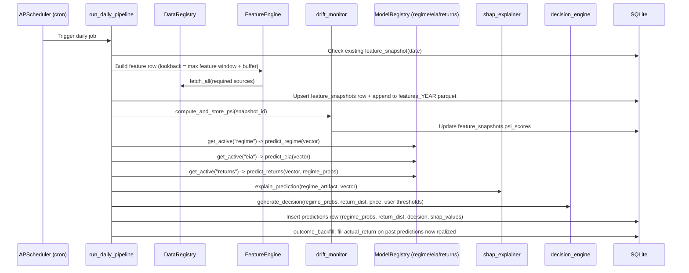
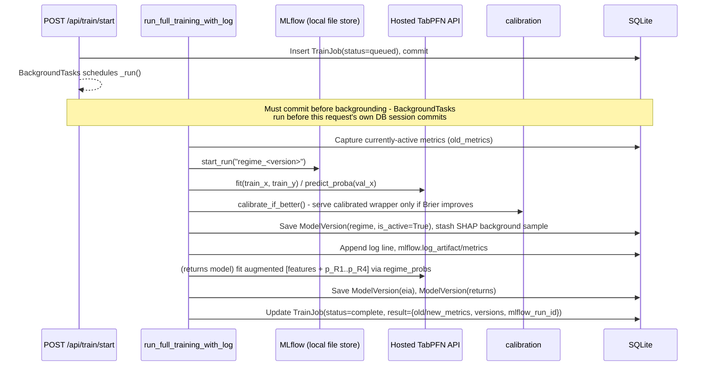
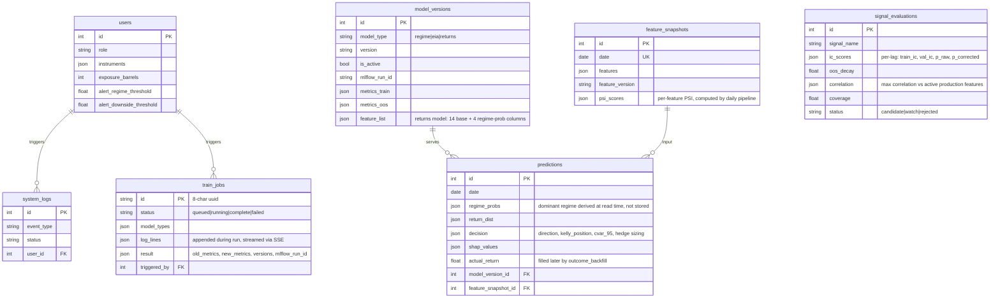

# Backend Architecture

Single-service FastAPI backend for oil-market signal research: ingests raw market/positioning/inventory data, engineers features, trains a three-model ML stack (regime classification, EIA inventory forecasting, conditional return distribution) via a hosted TabPFN API, runs a daily inference pipeline with drift monitoring and explainability, and serves role-specific reports plus a signal-research surface over HTTP.

This file is the backend deep-dive. See `docs/architecture.md` for the system-level overview (runtime containers, high-level data flow) shared with the rest of the project.

## Module Map

```
backend/
├── api/
│   ├── main.py              # FastAPI app factory, lifespan (init_db, default user)
│   ├── dependencies.py      # DbSession, CurrentUser (X-User-Id header)
│   └── routes/
│       ├── health.py        # GET /health
│       ├── reports.py       # GET /api/reports/daily/{role}, /history, /history/{date}, /stress
│       ├── models.py        # GET /api/models/status, POST /api/models/{type}/deploy
│       ├── training.py      # POST/GET /api/train/* (TrainJob-backed, SSE log stream)
│       ├── signals.py       # GET /api/signals/candidates, /active, /evaluate/{name}
│       └── users.py         # GET/PUT /api/users/me[/config]
│
├── core/
│   ├── config.py            # Settings (env vars incl. TABPFN_API_KEY)
│   ├── config_paths.py      # Resolved paths: data/, config/, models/, mlruns/, features/
│   ├── cache.py             # In-memory TTL cache used by DataRegistry
│   ├── exceptions.py        # ModelNotFoundError
│   ├── logging.py           # JSON structured logging
│   │
│   ├── data/
│   │   ├── registry.py      # DataRegistry: fetch/fetch_all, alignment, release-day/lag logic
│   │   └── sources/         # yahoo.py, eia.py, fred.py, cftc.py adapters
│   │
│   ├── models/               # Training + inference for the 3 production models
│   │   ├── trainer.py        # run_full_training[_with_log](), load_features(), MLflow setup
│   │   ├── regime.py          # TabPFNClassifier wrapper, dominant_regime(), predict_regime[_batch]()
│   │   ├── eia.py             # TabPFNRegressor wrapper, predict_eia()
│   │   ├── returns.py         # TabPFNClassifier wrapper, regime-probability feature augmentation
│   │   ├── calibration.py     # sklearn FrozenEstimator + CalibratedClassifierCV, reliability plots
│   │   ├── regime_validation.py # GMM cross-check against hand-curated regime labels
│   │   ├── regime_labels.py   # REGIME_TRANSITIONS (hand-curated ground truth) -> daily series
│   │   ├── labels.py          # Regime/EIA/return-bucket label builders from raw data
│   │   ├── model_registry.py  # In-memory cache of active model artifacts (ModelRegistry)
│   │   ├── tabpfn_setup.py    # ensure_tabpfn_authenticated() - lazy hosted-API auth
│   │   └── common.py          # classifier_metrics(), as_named_row() (TabPFN column-name shim)
│   │
│   ├── postprocess/           # Everything downstream of a raw model prediction
│   │   ├── decision_engine.py # direction/position sizing, CVaR, Kelly, hedge sizing
│   │   ├── report_assembler.py# Builds the full daily report dict from a Prediction row
│   │   ├── regime_stats.py    # Regime duration + empirical switch-probability estimate
│   │   ├── drift_monitor.py   # PSI (population stability index) per feature
│   │   ├── shap_explainer.py  # KernelExplainer-based feature attribution (regime model)
│   │   ├── stress_test.py     # Re-inference over 3 historical crisis scenarios
│   │   ├── signal_charts.py   # Price/IC chart series for the Signal Evaluate view
│   │   ├── data_monitor.py    # Feature coverage + per-source freshness status
│   │   └── outcome_backfill.py# Fills Prediction.actual_return once realized returns exist
│   │
│   └── signal_scanner.py     # Candidate signal IC testing with Bonferroni correction
│
├── features/
│   └── engine.py             # FeatureEngine: config-driven transform vocabulary, feature_version hash
│
├── db/
│   ├── models.py             # SQLAlchemy models (see Persistence Model below)
│   ├── database.py           # Async engine/session, get_db()
│   └── crud.py               # User/prediction/snapshot lookups
│
├── scheduler/
│   ├── runner.py             # APScheduler process: daily pipeline (cron) + weekly signal scan (Sun 3am)
│   └── jobs.py                # run_daily_pipeline(): snapshot -> PSI -> prediction -> outcome backfill
│
└── scripts/
    └── backfill.py            # One-time historical feature backfill (2010-2024) into Parquet
```

## Data Flow: Daily Pipeline



Notable: the returns model's `predict_returns()` always appends the regime model's own probability output as 4 extra features before scoring - this mirrors exactly how the returns model was trained (see Training Pipeline below), so live inference and training never see different feature layouts.

## Data Flow: Training Pipeline



Each of the three models is trained and **auto-activated immediately** - there is no staged "candidate, not yet live" state. `POST /api/models/{type}/deploy` exists for rollback (re-promoting an older completed job's version), not as a required gate before a freshly trained model goes live.

## API Surface

| Method | Path | Purpose |
|---|---|---|
| GET | `/health` | DB connectivity, user count, snapshot freshness |
| GET | `/api/reports/daily/{role}` | Role-filtered daily report (`trader`\|`risk`\|`researcher`\|`ds`) |
| GET | `/api/reports/history` | Recent prediction history (default 30 days) |
| GET | `/api/reports/history/{date}` | Full report + realized outcome for one date |
| GET | `/api/reports/stress` | Re-inference over 3 historical crisis scenarios |
| GET | `/api/models/status` | `{models, data_sources, feature_coverage_7d}` - PSI alerts, per-source freshness |
| POST | `/api/models/{type}/deploy` | Rollback: re-promote an older job's trained version |
| POST | `/api/train/start` | Kick off a background training run, returns `job_id` |
| GET | `/api/train/status/{job_id}` | Structured job state + old/new metrics comparison |
| GET | `/api/train/log/{job_id}` | SSE stream of training progress, closes on complete/failed |
| GET | `/api/signals/candidates` | Latest evaluation per candidate signal (IC, coverage, status) |
| GET | `/api/signals/active` | Production feature list enriched with source/frequency/category |
| GET | `/api/signals/evaluate/{name}` | Price/IC chart series + stats for one candidate signal |
| GET/PUT | `/api/users/me[/config]` | Current user profile and alert-threshold configuration |

All routes except `/health` require an `X-User-Id` header (defaults to user 1 if omitted).

## Persistence Model



## External Dependencies

| Dependency | Role | Notes |
|---|---|---|
| Yahoo Finance (yfinance) | WTI, Brent, OVX, VIX, copper, natural gas | Daily |
| EIA API | Crude/Cushing/gasoline/distillate inventory | Weekly, release-day-aware alignment |
| FRED | DXY | Daily |
| CFTC | COT positioning (managed money long/short) | Weekly ZIP files |
| **Hosted TabPFN API** (`tabpfn-client`) | Training + inference for all 3 production models | Chosen over local CPU inference to avoid TabPFN's ~1000-row CPU sample ceiling; makes daily inference itself dependent on this external API's availability. Auth via `TABPFN_API_KEY`. |
| MLflow (local file store) | Experiment tracking | `data/mlruns/`, `MLFLOW_ALLOW_FILE_STORE=true` required (file store is in maintenance mode upstream) |

## Known Architectural Simplifications

These are deliberate, documented tradeoffs - not gaps to "fix" without re-evaluating the cost/benefit:

- **`FeatureSnapshot` is not a historical data source.** It only holds rows the live daily pipeline has actually produced going forward; it was never backfilled. Every feature needing real history (stress-test scenario dates, COT percentile, price history, signal charts, data-source freshness) reads from the backfilled + incrementally-appended feature Parquet matrix (`core/models/trainer.load_features`) or a live `DataRegistry` fetch instead.
- **Dominant regime is derived at read time**, never stored (`core/models/regime.dominant_regime()`), from `Prediction.regime_probs` JSON. There is deliberately no denormalized `dominant_regime` column.
- **PSI and COT-percentile lookups both have minimum-sample guards** that fall back to a neutral value (`0.0` / `50.0`) rather than a mathematically-valid-but-meaningless extreme when too little history has accumulated - relevant mainly during early production ramp-up.
- **PSI is one global value reused across all 3 models**, not genuinely per-model-type, since all three models draw on the same active feature set.
- **Per-source data freshness is a single shared signal**, not independent per-source timestamps - there's no persisted per-source raw cache to check individually, only the engineered feature matrix's most recent row, which every source feeds into.
- **`POST /api/models/{type}/deploy` is a no-op under normal operation** - training auto-activates. It exists for explicit rollback to a specific older job's version.
