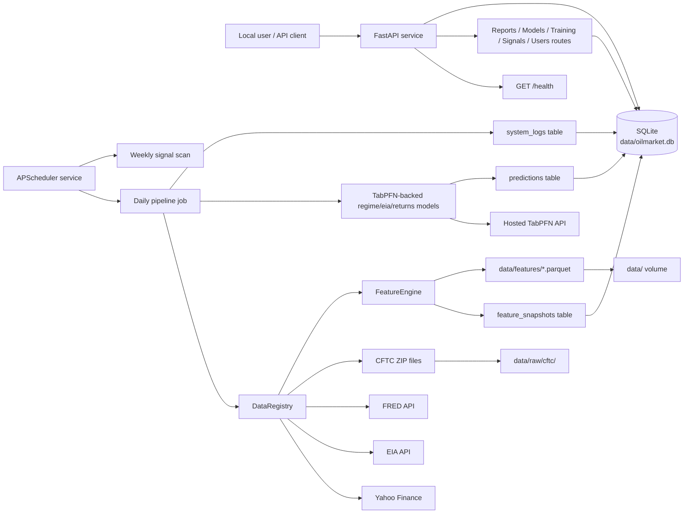
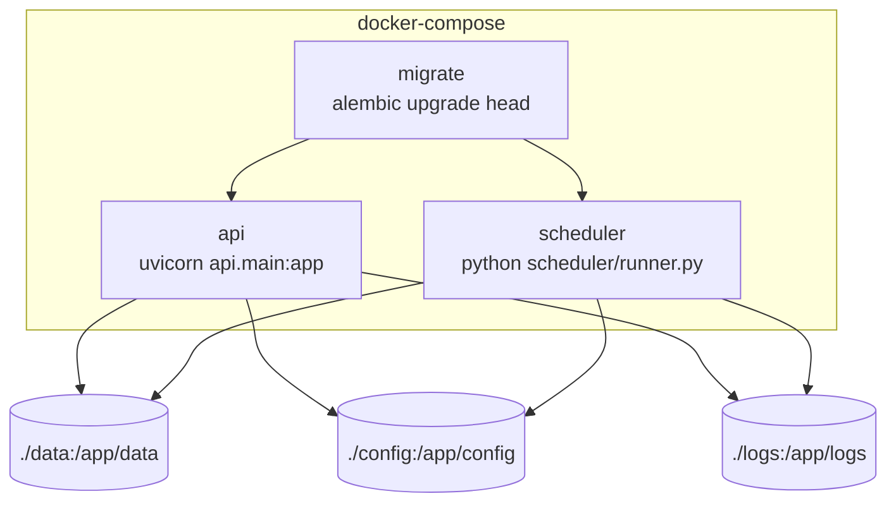
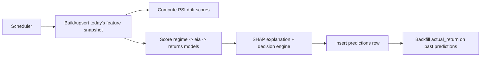
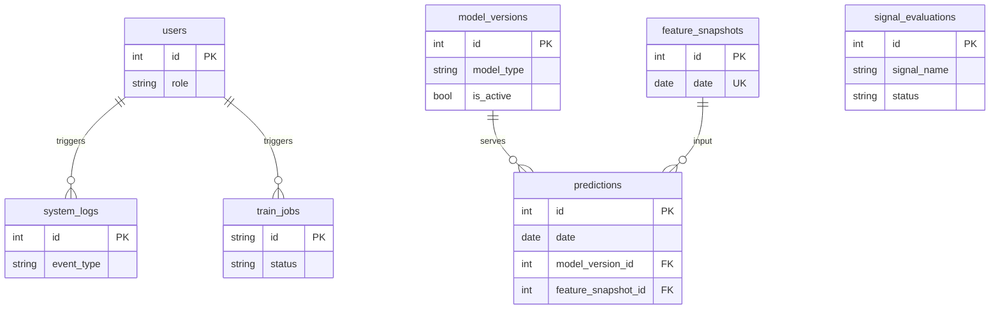

# Architecture

> This file is the system-level overview. For the full backend module
> breakdown, ML training pipeline, API surface, and persistence model, see
> [`docs/architecture-backend.md`](architecture-backend.md). There is no
> frontend yet (`frontend/` is a placeholder) - once one exists it should get
> its own `docs/architecture-frontend.md` rather than growing this file.

## System Overview

The system provides a scheduled daily ingestion + inference pipeline, a
three-model ML stack (regime classification, EIA forecasting, conditional
return distribution) trained via a hosted TabPFN API, drift/explainability
monitoring, and a role-aware reporting + signal-research API surface. See
`docs/architecture-backend.md` for the full detail.

## Runtime Containers

## Backend Modules

Full module breakdown (API routes, `core/models/` training+inference,
`core/postprocess/` decision/monitoring layer, `features/`, `db/`,
`scheduler/`) lives in
[`docs/architecture-backend.md`](architecture-backend.md#module-map).

## Daily Pipeline

High-level stages (see
[`docs/architecture-backend.md`](architecture-backend.md#data-flow-daily-pipeline)
for the full sequence including PSI, SHAP, and the decision engine):

## Persistence Model

Entity relationships only - see
[`docs/architecture-backend.md`](architecture-backend.md#persistence-model)
for the full field-level ERD, including `train_jobs` and the
MLflow/PSI/calibration-related columns.

