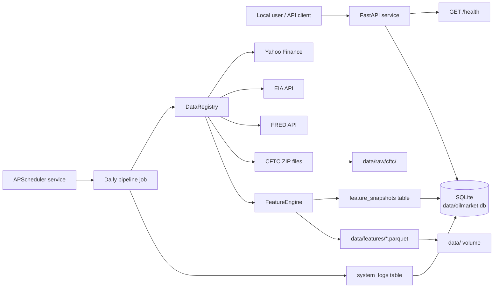
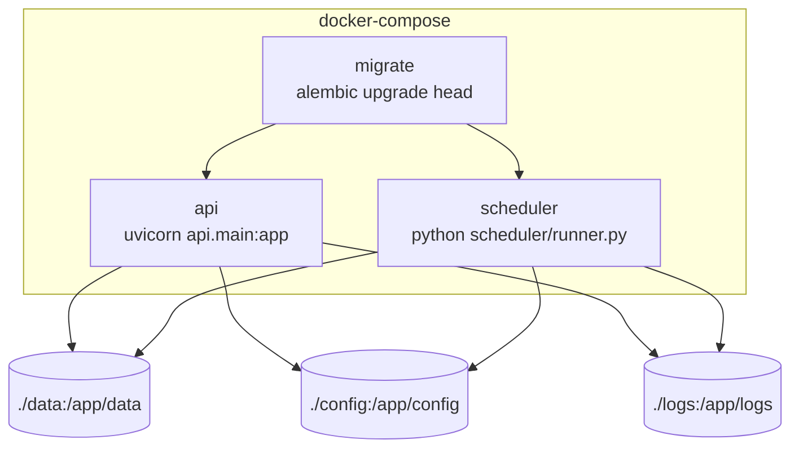
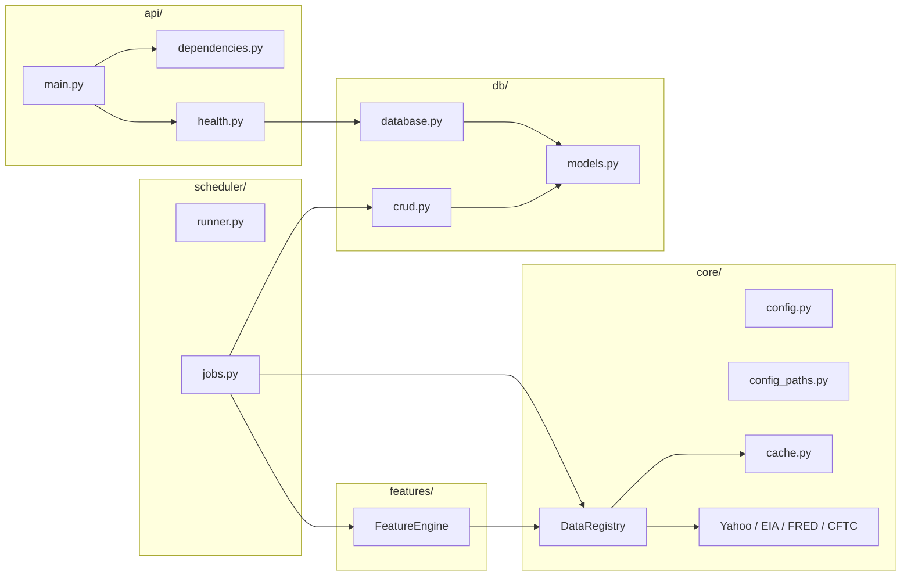
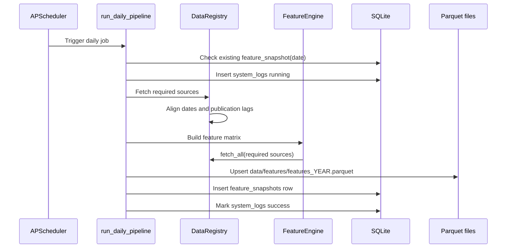
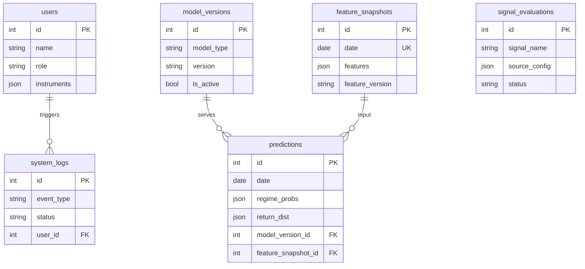

# Architecture

## System Overview

The current system provides API health checks, database schema, real data-source adapters, feature construction, scheduled daily pipeline, and local persistence.

## Runtime Containers

## Backend Modules

## Daily Pipeline

## Persistence Model

