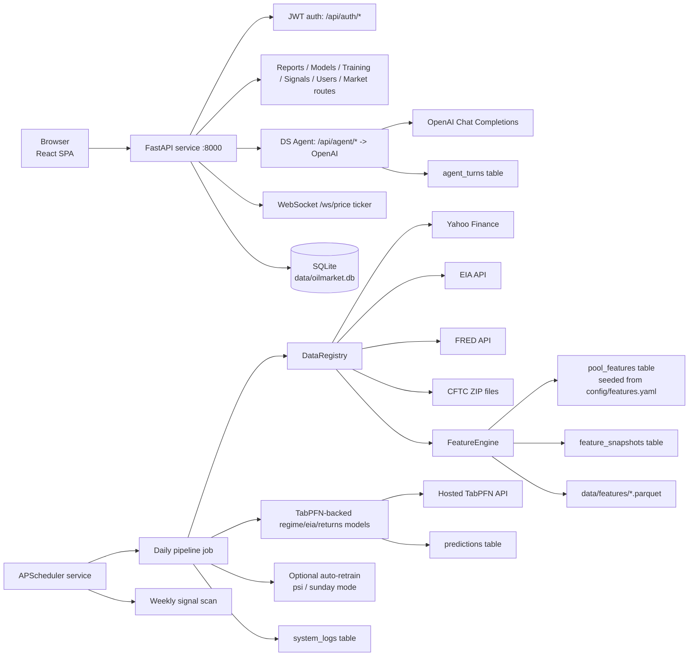
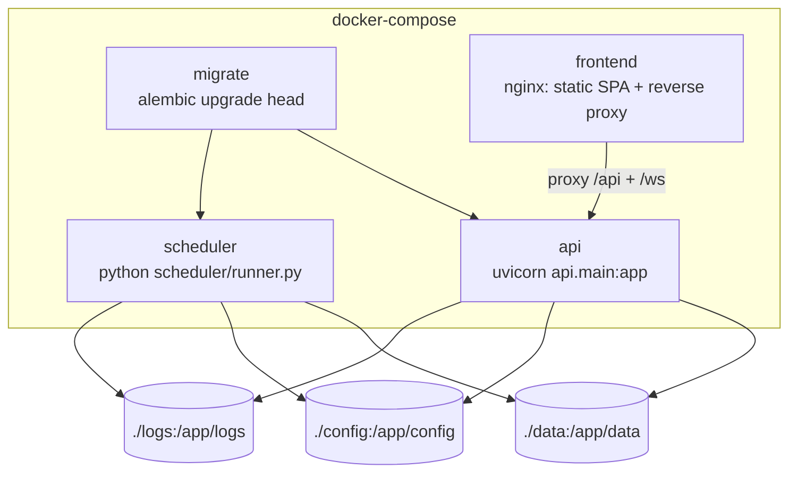
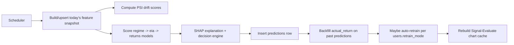
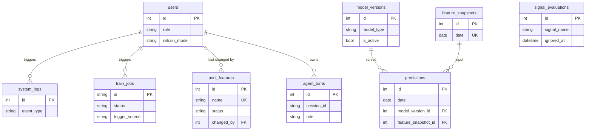

# Architecture

> This file is the system-level overview. For the full backend module
> breakdown, ML training pipeline, API surface, and persistence model, see
> [`docs/architecture-backend.md`](architecture-backend.md). For the React
> SPA's structure, routing, auth, and data-fetching conventions, see
> [`docs/architecture-frontend.md`](architecture-frontend.md).

## System Overview

The system provides a scheduled daily ingestion + inference pipeline, a
three-model ML stack (regime classification, EIA forecasting, conditional
return distribution) trained via a hosted TabPFN API, drift/explainability
monitoring, a role-aware reporting + signal-research API surface secured
with JWT auth, a real-OpenAI DS Agent with multi-step tool use, and a React
SPA that consumes it all directly. See `docs/architecture-backend.md` and
`docs/architecture-frontend.md` for the full detail on each side.

## Runtime Containers

All four services run under Docker Compose. The `frontend` nginx container
serves the built SPA and reverse-proxies `/api` and `/ws` to the `api`
service, so in the container path the whole stack is **same-origin** (no
CORS needed). In local dev the frontend runs separately via `npm run dev`
(Vite, port 5173) against `http://localhost:8000`, and the backend's CORS
middleware allow-lists that dev origin.

## Backend Modules

Full module breakdown (API routes incl. auth/agent/market/ws,
`core/models/` training+inference, `core/postprocess/` decision/monitoring
layer, `core/agent/` OpenAI tool-use loop, `core/services/` feature-pool +
deploy, `features/`, `db/`, `scheduler/`) lives in
[`docs/architecture-backend.md`](architecture-backend.md#module-map).

## Frontend

React 18 + Vite SPA behind a JWT login: role-gated dashboard, history,
signal research, and a DS Workbench (data/model monitoring, training
control with run history) plus a real DS Agent chat panel. Consumes the
backend's API surface directly - no mock layer. Full module breakdown,
routing, auth, and data-fetching conventions live in
[`docs/architecture-frontend.md`](architecture-frontend.md#module-map).

## Daily Pipeline

High-level stages (see
[`docs/architecture-backend.md`](architecture-backend.md#data-flow-daily-pipeline)
for the full sequence including PSI, SHAP, and the decision engine):

## Persistence Model

Entity relationships only - see
[`docs/architecture-backend.md`](architecture-backend.md#persistence-model)
for the full field-level ERD.

